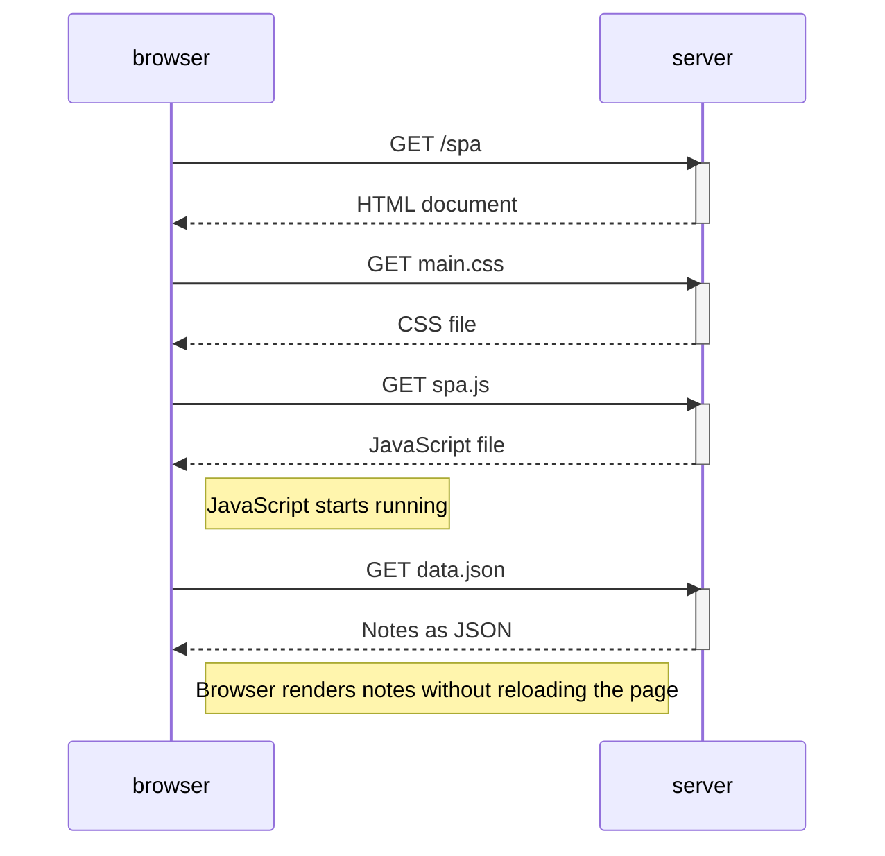

```mermaid
sequenceDiagram
    participant browser
    participant server

    browser->>server: GET /spa
    activate server
    server-->>browser: HTML document
    deactivate server

    browser->>server: GET main.css
    activate server
    server-->>browser: CSS file
    deactivate server

    browser->>server: GET spa.js
    activate server
    server-->>browser: JavaScript file
    deactivate server

    Note right of browser: JavaScript starts running

    browser->>server: GET data.json
    activate server
    server-->>browser: Notes as JSON
    deactivate server

    Note right of browser: Browser renders notes without reloading the page
```
